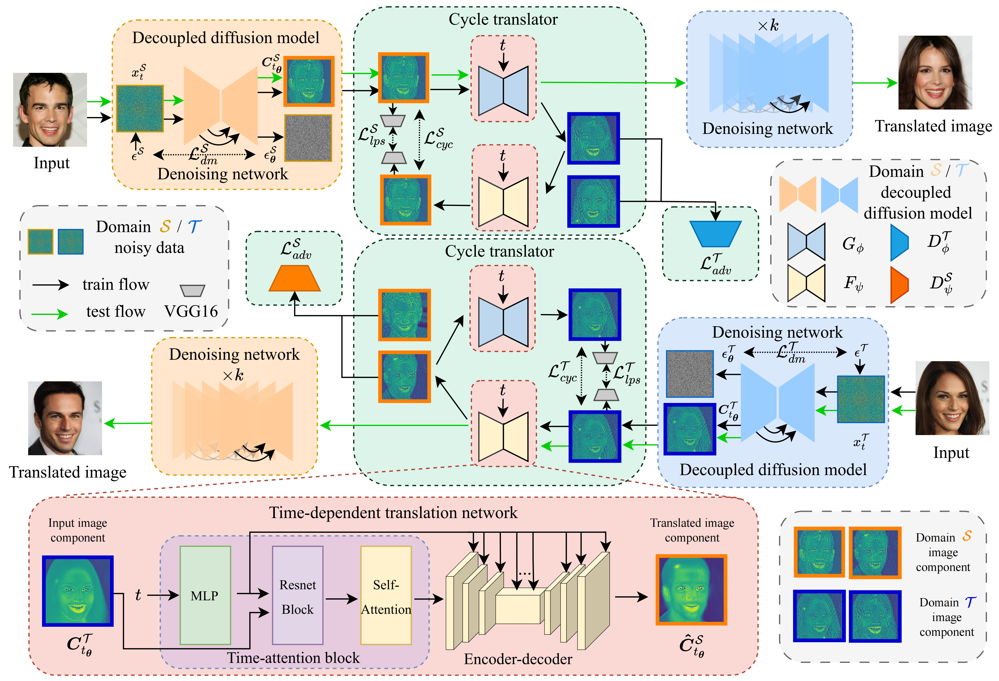

# 🌟 CycleDiff [](https://zoushilong1024.github.io/CycleDiff.github.io/)	[](https://arxiv.org/abs/2508.06625)

<br> 
<div align=center>
    
</div>
<br>

- [🌟 CycleDiff 	](#-cyclediff-)
  - [🛠 Installation](#-installation)
  - [🚀 Train CycleDiff from scratch](#-train-cyclediff-from-scratch)
    - [0. prepare dataset](#0-prepare-dataset)
    - [1. train VAE](#1-train-vae)
    - [2. train ldm](#2-train-ldm)
    - [3. train cycle translator](#3-train-cycle-translator)
  - [Test CycleDiff](#test-cyclediff)
  - [🙏 Acknowledgement](#-acknowledgement)
  - [📜 License](#-license)


## 🛠 Installation
```bash
conda create -n cyclediff python=3.9 && conda activate CycleDiff
git clone https://github.com/ZouShilong1024/CycleDiff.git && cd CycleDiff
pip install torch==1.13.1+cu117 torchvision==0.14.1+cu117 torchaudio==0.13.1 --extra-index-url https://download.pytorch.org/whl/cu117
pip install -r requirement.txt
```

<!-- ## 🔥 News -->
<!-- - 06-30-2025: Release pre-trained cat-to-dog image translation model. See USAGE.md for usage examples. -->

## 🚀 Train CycleDiff from scratch
### 0. prepare dataset
The training and testing dataset structure should look like:
```
datasetA2B
|-- train
|   |-- class_A
|   |   |-- 0.png
|   |   |-- 1.png
|   |   |-- ...
|   |-- class_B
|   |   |-- 0.png
|   |   |-- 1.png
|   |   |-- ...
|-- test
|   |-- class_A
|   |   |-- 0.png
|   |   |-- 1.png
|   |   |-- ...
|   |-- class_B
|   |   |-- 0.png
|   |   |-- 1.png
|   |   |-- ...
```
### 1. train VAE
```bash
accelerate launch train_vae.py --cfg ./configs/{datasetA2B}/{class_A}_ae_kl_256x256_d4.yaml
accelerate launch train_vae.py --cfg ./configs/{datasetA2B}/{class_B}_ae_kl_256x256_d4.yaml
```
### 2. train ldm
```bash
accelerate launch train_uncond_ldm.py --cfg ./configs/{datasetA2B}/{class_A}_ddm_const4_ldm_unet6_114.yaml
accelerate launch train_uncond_ldm.py --cfg ./configs/{datasetA2B}/{class_B}_ddm_const4_ldm_unet6_114.yaml
```
### 3. train cycle translator
```bash
accelerate launch train_uncond_ldm_cycle.py --cfg ./configs/{datasetA2B}/translation_C_disc_timestep_ode_2.yaml
```

## Test CycleDiff
```bash
accelerate launch translation_uncond_ldm_cycle.py --cfg ./configs/{datasetA2B}/translation_C_disc_timestep_ode_2.yaml
```

## 🙏 Acknowledgement
Our Code is based on [ADM](https://github.com/GuHuangAI/ADM-Public) and [CycleGAN](https://github.com/junyanz/pytorch-CycleGAN-and-pix2pix)

## 📜 License
